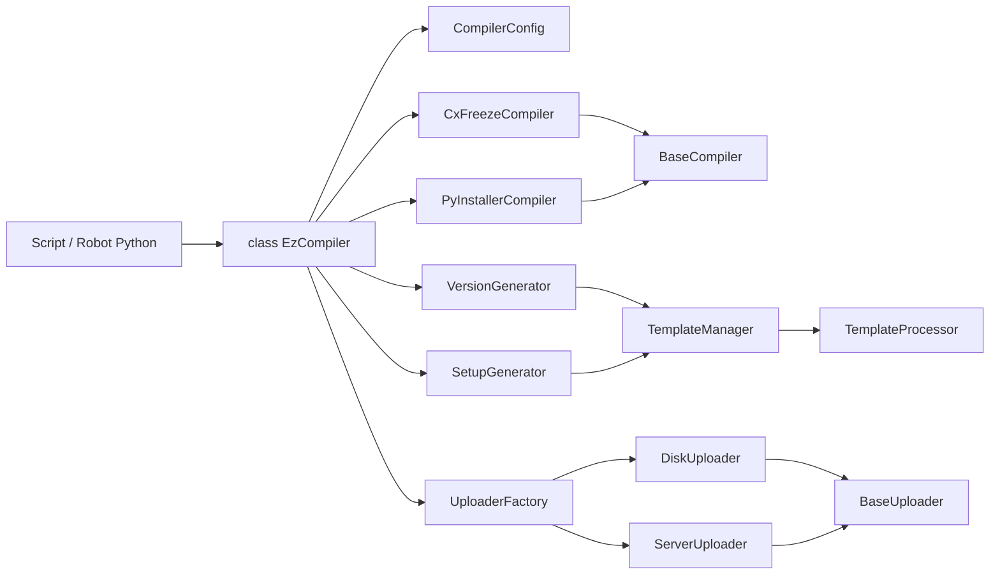

# API Summary

**EzCompiler** – Quick reference for the Python compilation and distribution library.

## Table of Contents

- [API Summary](#api-summary)
  - [Table of Contents](#table-of-contents)
  - [📖 Complete Documentation](#-complete-documentation)
  - [Quick Overview](#quick-overview)
    - [Main Components](#main-components)
    - [Architecture Diagram](#architecture-diagram)
  - [Module Reference](#module-reference)
    - [EzCompiler (Facade)](#ezcompiler-facade)
    - [CompilerConfig](#compilerconfig)
    - [Compilers](#compilers)
    - [Generators](#generators)
    - [Templates](#templates)
    - [Uploaders](#uploaders)
    - [Utilities](#utilities)
    - [Exceptions](#exceptions)
  - [Type Aliases](#type-aliases)
  - [Installation](#installation)
  - [Additional Resources](#additional-resources)

---

## 📖 Complete Documentation

For detailed API documentation, see **[API_DOCUMENTATION.md](API_DOCUMENTATION.md)**.

---

## Quick Overview

### Main Components

EzCompiler provides a modular architecture with these main components:

- **EzCompiler** (`ezcompiler/ezcompiler.py`) – Main facade class
- **CompilerConfig** (`ezcompiler/core/compiler_config.py`) – Configuration dataclass
- **Compilers** (`ezcompiler/compilers/`) – Compiler implementations
- **Generators** (`ezcompiler/generators/`) – File generators
- **Templates** (`ezcompiler/templates/`) – Template management
- **Uploaders** (`ezcompiler/uploaders/`) – Distribution uploaders
- **Utils** (`ezcompiler/utils/`) – Utility classes

### Architecture Diagram



### Quick Start

```python
from ezcompiler import EzCompiler

# Create compiler instance
ezcompiler = EzCompiler()

# Initialize project
ezcompiler.init_project(
    version="1.0.0",
    project_name="MyProject",
    main_file="main.py",
    include_files={"files": ["config.yaml"], "folders": ["assets"]},
    output_folder="dist",
)

# Generate files and compile
ezcompiler.generate_version_file()
ezcompiler.generate_setup_file("setup.py")
ezcompiler.compile_project(compiler="PyInstaller")

# Distribute
ezcompiler.zip_compiled_project()
ezcompiler.upload_to_repo(structure="disk", repo_path="./releases")
```

## Module Reference

### EzCompiler (Facade)

Main entry point for the library.

**Key Methods:**

- `init_project(...)` – Initialize project configuration
- `generate_version_file(...)` – Generate version info file
- `generate_setup_file(...)` – Generate setup.py file
- `compile_project(...)` – Compile the project
- `zip_compiled_project()` – Create ZIP archive
- `upload_to_repo(...)` – Upload to repository

**Properties:**

- `logger` – Internal logger instance
- `printer` – Internal printer instance
- `config` – Current configuration

### CompilerConfig

Configuration dataclass for compilation settings.

**Required Fields:**

- `version` – Project version
- `project_name` – Project name
- `main_file` – Main Python file
- `output_folder` – Output directory

**Optional Fields:**

- `project_description` – Description
- `company_name` – Company name
- `author` – Author name
- `icon` – Icon file path
- `packages` – Packages to include
- `excludes` – Modules to exclude
- `console` – Show console window
- `compiler` – Compiler choice

**Methods:**

- `to_dict()` – Convert to dictionary
- `from_dict(data)` – Create from dictionary
- `validate()` – Validate configuration

### Compilers

**BaseCompiler** – Abstract base class

- `compile()` – Execute compilation (abstract)
- `get_compiler_name()` – Get compiler name (abstract)
- `zip_needed` – Whether ZIP is needed (property)

**CxFreezeCompiler** – Cx_Freeze implementation

- Creates directory-based output
- `zip_needed = True`

**PyInstallerCompiler** – PyInstaller implementation

- Creates single-file output (onefile mode)
- `zip_needed = False`

### Generators

**VersionGenerator** – Version file generation

- `generate(config, output_path)` – Generate version content
- `generate_to_file(config, output_path)` – Generate and write file

**SetupGenerator** – Setup.py generation

- `generate_from_config(config, output_dir)` – Generate setup content
- `generate_to_file(config, output_path)` – Generate and write file

### Templates

**TemplateManager** – Template management

- `load_template(name)` – Load template by name
- `list_templates()` – List available templates
- `process_template(name, variables)` – Process template

**TemplateProcessor** – Variable substitution

- `substitute(template, variables)` – Substitute variables
- `generate_mockup(type)` – Generate example content
- `validate_template(template, required_vars)` – Validate template

### Uploaders

**BaseUploader** – Abstract base class

- `upload()` – Execute upload (abstract)
- `validate()` – Validate configuration (abstract)

**DiskUploader** – Local disk operations

- Copy files/directories locally
- Preserve permissions option

**ServerUploader** – HTTP/HTTPS uploads

- Upload via HTTP POST/PUT
- Authentication support
- Retry logic

**UploaderFactory** – Factory pattern

- `create_uploader(structure, source, destination)` – Create uploader

### Utilities

**FileUtils** – File operations

- `ensure_directory(path)` – Create directory
- `copy_file(src, dst)` – Copy file
- `copy_directory(src, dst)` – Copy directory
- `delete_directory(path)` – Delete directory

**ValidationUtils** – Validation operations

- `validate_version(version)` – Validate version format
- `validate_path(path)` – Validate path exists
- `validate_compiler_name(name)` – Validate compiler
- `validate_upload_structure(structure)` – Validate upload structure

**ZipUtils** – ZIP operations

- `create_zip_archive(source, destination)` – Create ZIP
- `extract_zip_archive(source, destination)` – Extract ZIP
- `list_zip_contents(archive)` – List contents

### Exceptions

Custom exception hierarchy:

- `EzCompilerError` – Base exception
- `CompilationError` – Compilation errors
- `ConfigurationError` – Configuration errors
- `TemplateError` – Template errors
- `VersionError` – Version generation errors
- `UploadError` – Upload errors
- `ValidationError` – Validation errors

## Type Aliases

```python
from ezcompiler import Config, Compiler

# Config is alias for CompilerConfig
# Compiler is alias for BaseCompiler
```

## Installation

```bash
pip install ezcompiler
```

## Additional Resources

- **[Complete API Documentation](API_DOCUMENTATION.md)** – Detailed API reference
- **[CLI Documentation](../cli/CLI_DOCUMENTATION.md)** – Command-line interface
- **[Examples](../examples/EXAMPLES.md)** – Usage examples
- **[Test Documentation](../tests/TEST_DOCUMENTATION.md)** – Test suite

---

**EzCompiler** – Professional Python compilation and distribution.
